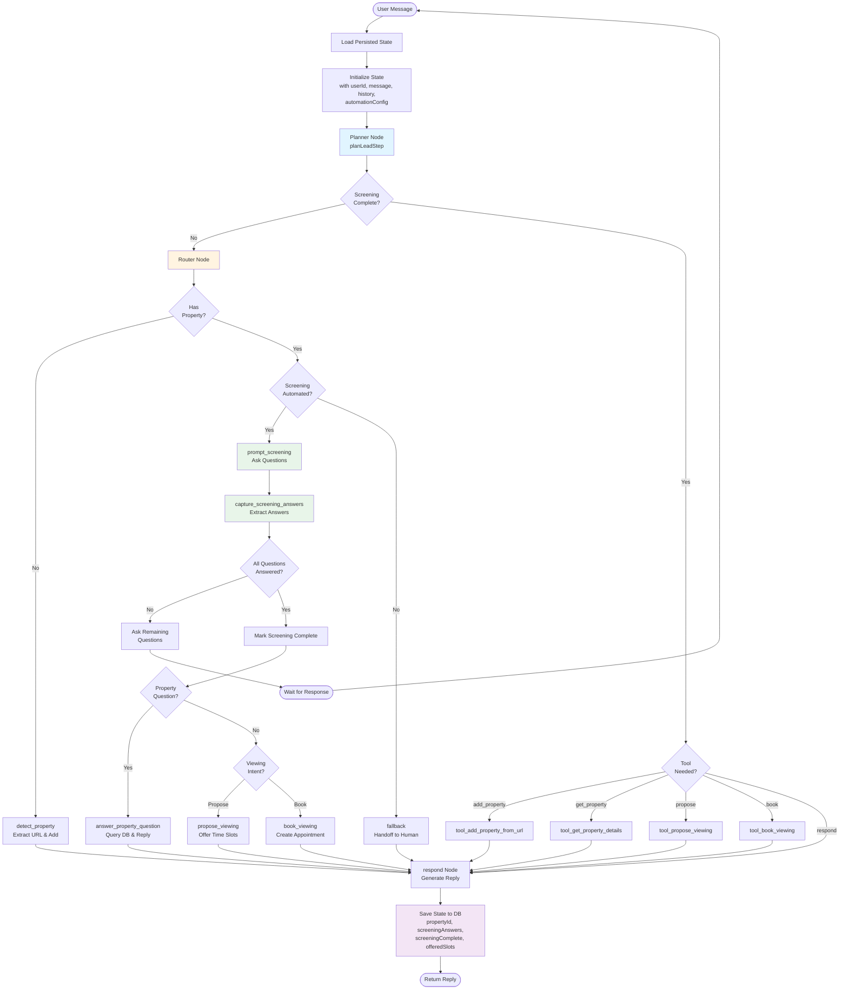
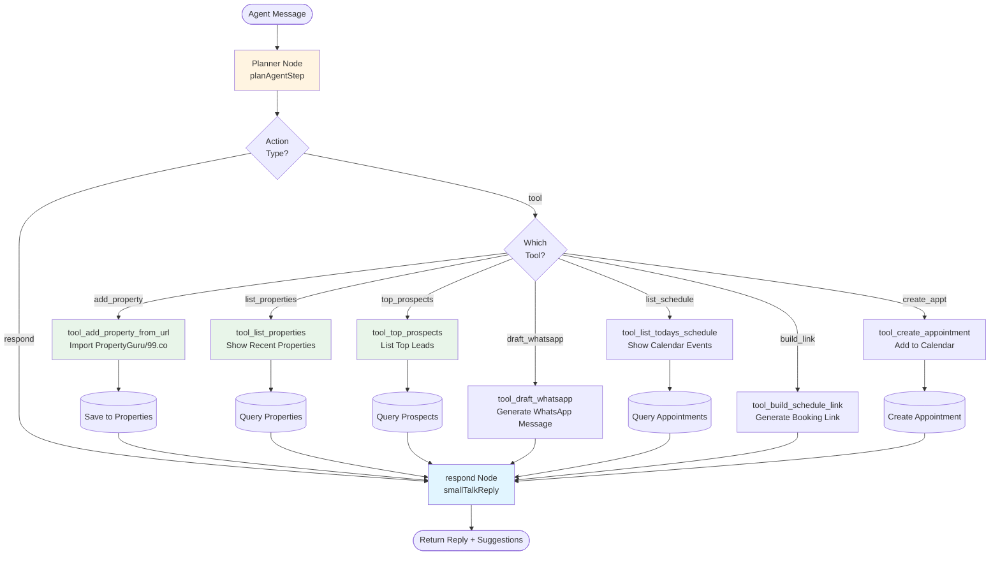
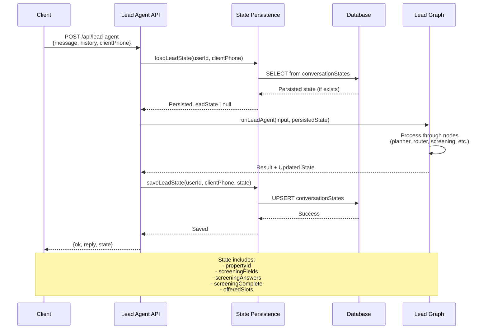
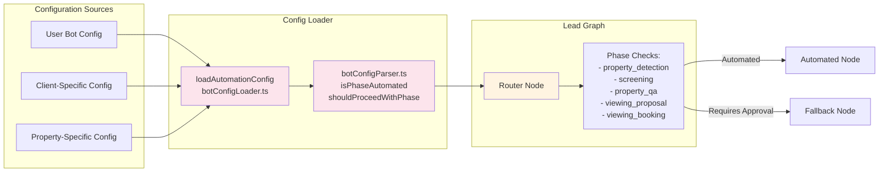

# Agent Architecture Diagram

This document provides a visual representation of the Lead Agent and Agent (Assistant) architecture using Mermaid diagrams.

## System Architecture Overview

```mermaid
graph TB
    subgraph "Client Layer"
        WA[WhatsApp Webhook]
        UI[Dashboard UI]
        API_CLIENT[API Clients]
    end

    subgraph "API Layer"
        LEAD_API["/api/lead-agent<br/>(Lead Conversations)"]
        AGENT_API["/api/agent<br/>(Agent Assistant)"]
        SETUP_API["/api/agent/setup<br/>(Onboarding)"]
        WA_WEBHOOK["/api/whatsapp/webhook<br/>(WhatsApp Integration)"]
    end

    subgraph "Agent Layer - LangGraph"
        LEAD_GRAPH[Lead Graph<br/>leadGraph.ts]
        AGENT_GRAPH[Agent Graph<br/>graph.ts]
        SETUP_GRAPH[Setup Graph<br/>setupGraph.ts]
    end

    subgraph "LLM Layer"
        LLM_FUNCTIONS[LLM Functions<br/>llm.ts]
        PLAN_LEAD[planLeadStep]
        LEAD_REPLY[leadReply]
        PLAN_AGENT[planAgentStep]
        SMALL_TALK[smallTalkReply]
        PLAN_SETUP[planSetupStep]
    end

    subgraph "Tools Layer"
        PROP_TOOL[addPropertyFromUrl]
        APPT_TOOL[createAppointment]
        LIST_TOOL[listRecentProperties]
        PROSPECT_TOOL[listTopProspects]
        SCHEDULE_TOOL[listTodaysAppointments]
        SETUP_TOOLS[Setup Tools]
    end

    subgraph "State Management"
        STATE_PERSIST[Lead State Persistence<br/>lead-state-persistence.ts]
        CONV_DB[(Conversation States DB)]
    end

    subgraph "Data Layer"
        DB[(Database)]
        PROPERTIES[Properties Table]
        APPOINTMENTS[Appointments Table]
        MESSAGES[Messages Table]
        CONVERSATIONS[Conversations Table]
    end

    subgraph "Config Layer"
        BOT_CONFIG[Bot Configuration<br/>botConfigLoader.ts]
        AUTOMATION_CONFIG[Automation Rules]
    end

    %% Client to API connections
    WA --> WA_WEBHOOK
    UI --> LEAD_API
    UI --> AGENT_API
    UI --> SETUP_API
    API_CLIENT --> LEAD_API
    API_CLIENT --> AGENT_API

    %% API to Agent connections
    LEAD_API --> LEAD_GRAPH
    AGENT_API --> AGENT_GRAPH
    SETUP_API --> SETUP_GRAPH
    WA_WEBHOOK --> LEAD_GRAPH

    %% Agent to LLM connections
    LEAD_GRAPH --> PLAN_LEAD
    LEAD_GRAPH --> LEAD_REPLY
    AGENT_GRAPH --> PLAN_AGENT
    AGENT_GRAPH --> SMALL_TALK
    SETUP_GRAPH --> PLAN_SETUP

    %% Agent to Tools connections
    LEAD_GRAPH --> PROP_TOOL
    LEAD_GRAPH --> APPT_TOOL
    AGENT_GRAPH --> PROP_TOOL
    AGENT_GRAPH --> LIST_TOOL
    AGENT_GRAPH --> PROSPECT_TOOL
    AGENT_GRAPH --> SCHEDULE_TOOL
    SETUP_GRAPH --> SETUP_TOOLS

    %% State management
    LEAD_GRAPH --> STATE_PERSIST
    STATE_PERSIST --> CONV_DB
    LEAD_API --> STATE_PERSIST
    WA_WEBHOOK --> STATE_PERSIST

    %% Tools to Data connections
    PROP_TOOL --> PROPERTIES
    APPT_TOOL --> APPOINTMENTS
    LIST_TOOL --> PROPERTIES
    PROSPECT_TOOL --> DB
    SCHEDULE_TOOL --> APPOINTMENTS
    STATE_PERSIST --> CONV_DB

    %% Config connections
    LEAD_GRAPH --> BOT_CONFIG
    BOT_CONFIG --> AUTOMATION_CONFIG

    %% Data layer connections
    PROPERTIES --> DB
    APPOINTMENTS --> DB
    MESSAGES --> DB
    CONVERSATIONS --> DB
    CONV_DB --> DB

    style LEAD_GRAPH fill:#e1f5ff
    style AGENT_GRAPH fill:#fff4e1
    style SETUP_GRAPH fill:#e8f5e9
    style STATE_PERSIST fill:#f3e5f5
    style BOT_CONFIG fill:#fce4ec
```

## Lead Agent Flow (Detailed)

## Agent (Assistant) Flow (Detailed)

## State Persistence Flow

## Automation Configuration Flow

## Key Components

### Lead Agent (leadGraph.ts)
- **Purpose**: Handles conversations with prospects/clients
- **Key Features**:
  - Property detection from URLs
  - Screening questionnaire flow
  - Property Q&A
  - Viewing proposal and booking
  - State persistence across conversations
  - Automation rule enforcement

### Agent (graph.ts)
- **Purpose**: Assistant for property agents
- **Key Features**:
  - Property management (add, list)
  - Prospect management
  - Schedule management
  - WhatsApp message drafting
  - Calendar integration

### Setup Agent (setupGraph.ts)
- **Purpose**: Onboarding and configuration
- **Key Features**:
  - Setup checklist
  - Questionnaire configuration
  - Calendar integration setup
  - Calendly URL setup

### State Persistence
- **Purpose**: Maintain conversation context across sessions
- **Stored Data**:
  - Property ID and details
  - Screening fields and answers
  - Screening completion status
  - Offered viewing slots
- **Key Functions**:
  - `saveLeadState()`: Persist state to database
  - `loadLeadState()`: Retrieve state for conversation
  - `extractPersistedState()`: Extract state from graph result

### Automation Configuration
- **Purpose**: Control which phases are automated vs require approval
- **Phases**:
  - `property_detection`: Auto-detect and add properties
  - `screening`: Automated screening questions
  - `property_qa`: Answer property questions
  - `viewing_proposal`: Propose viewing slots
  - `viewing_booking`: Book appointments
- **Configuration Levels**:
  - User-level defaults
  - Client-specific overrides
  - Property-specific overrides

